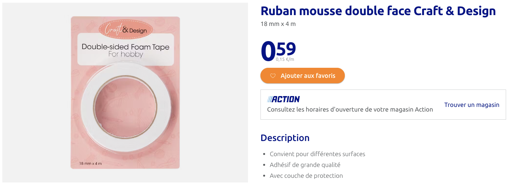
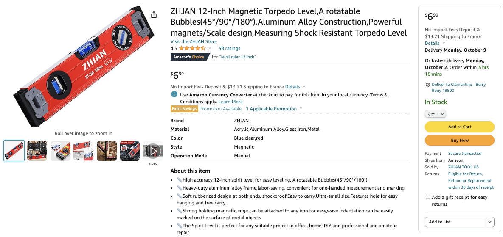

# Functional Specifications

## Team 3

Table of Contents - <b>Click to expand</b>

- [Functional Specifications](#functional-specifications)
  - [Team 3](#team-3)
  - [Overview](#overview)
  - [Project Scope](#project-scope)
  - [Do Not](#do-not)
  - [Fresco](#fresco)
  - [Final Solution](#final-solution)
    - [Set up](#set-up)
    - [Transportation](#transportation)
  - [Other solutions](#other-solutions)
  - [Equipment](#equipment)
    - [Available](#available)
    - [Needed](#needed)
  - [Cost analysis](#cost-analysis)
  - [Risks](#risks)
  - [Milestones](#milestones)
  - [Sources](#sources)
  - [Glossary](#glossary)

## Overview

This project is for ALGOSUP school. We need to make a Rubik's cube fresco for the building.
<!-- What? -->

## Project Scope
<!-- Why? -->

## Do Not
<!-- What not to do -->

## Fresco

<!-- Image + dimension -->
<!-- befre after of the room -->
<!-- elments and why? -->
<!-- reel and pixelize inspiration -->

## Final Solution

### Set up

### Transportation

## Other solutions

<!-- Shelf + mockup-->
<!-- Integration of the plugs with a drawer + mockup-->
<!-- Above and under the plugs + mockup-->
<!-- Why and why not? -->

## Equipment

### Available

To carry out the project, these elements are available:
- **3000 Rubik's cubes 3x3**
  - Square,
  - 5,5 cm³ / 2.16535 inches³,
  - 64 grammes / 2.25753 onces,
  - Red, blue, green, orange, white and yellow
- **60 cm / 24 inches tracer**
- **Project room**
- **Library's wall**
  - 600 cm / 236.22 inches horizontally,
  - 220 cm / 86.6142 inches vertically

### Needed

To be able to build the freso, we will need:
- **Double-sided adhesive**

- **Bubble level**

## Cost analysis

## Risks

## Milestones

## Sources

## Glossary

Rubik's cube
cm / inches
grammes / onces
bubble level
fresco
double-sized adhesive
