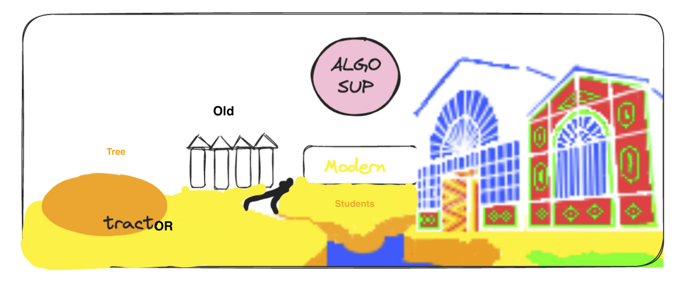
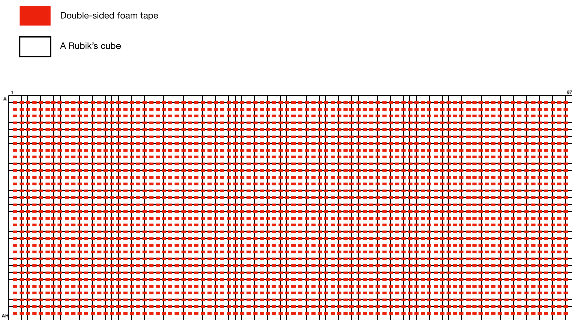
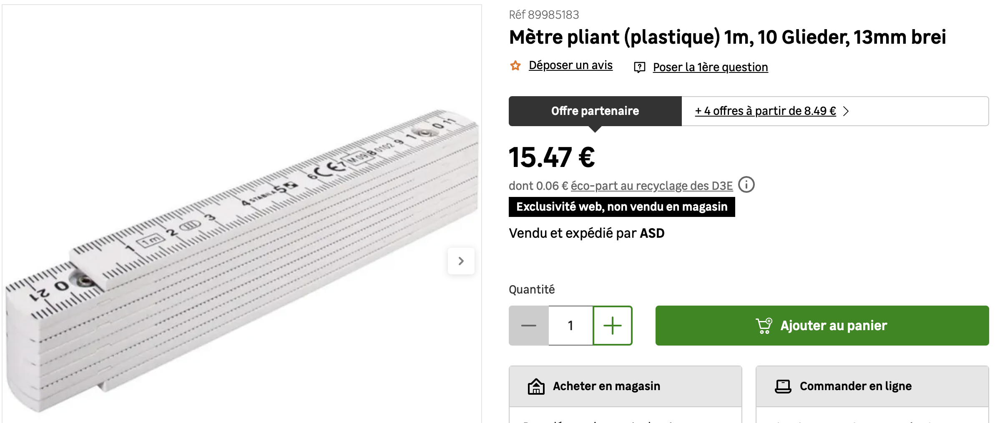
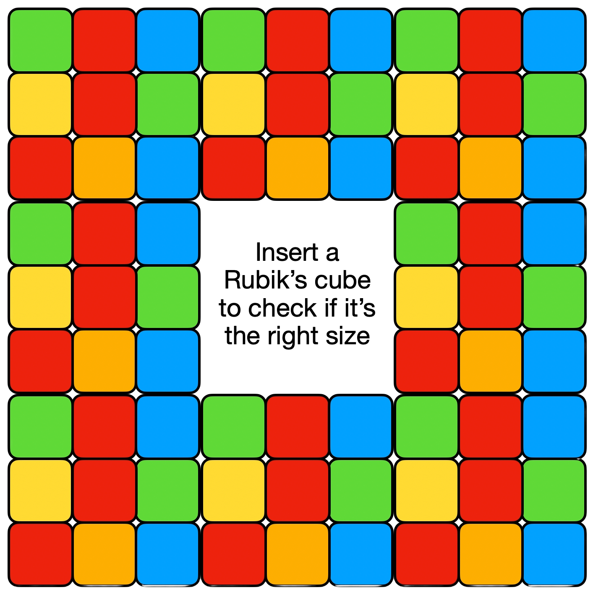

# Functional Specifications - Team 3

- [Functional Specifications - Team 3](#functional-specifications---team-3)
  - [Overview](#overview)
  - [Project Scope](#project-scope)
  - [What is the project?](#what-is-the-project)
  - [What is not the project?](#what-is-not-the-project)
  - [Personas](#personas)
    - [Persona 1](#persona-1)
    - [Persona 2](#persona-2)
  - [Thinking Process](#thinking-process)
  - [Fresco](#fresco)
    - [The idea](#the-idea)
    - [The Final](#the-final)
  - [Tasks](#tasks)
    - [Timelapse](#timelapse)
    - [Division of the work](#division-of-the-work)
    - [Creation of the fresco](#creation-of-the-fresco)
    - [Transfer](#transfer)
    - [Set up](#set-up)
  - [Equipment](#equipment)
    - [Available](#available)
    - [Needed](#needed)
  - [Budget](#budget)
  - [Laws and Regulations](#laws-and-regulations)
  - [Risks](#risks)
  - [Milestones](#milestones)
  - [Team](#team)
  - [Sources](#sources)
  - [Glossary](#glossary)

## Overview

ALGOSUP invites proposals for the creation of a unique and visually stunning fresco. This 5-weeks project aims to transform a 60-100 square feet space into a permanent masterpiece made entirely of Rubik's cubes. Each cube will function as a 3x3 pixel matrix, with each facet representing a pixel in one of six colors: green, yellow, red, orange, blue, or white.
This fresco will become a permanent feature of ALGOSUP's school, it will be housed in the library and visible from the outside.

## Project Scope

Eight teams will submit proposals, each presenting an image and a functional plan in response to this call for tender. From these submissions, one team will be selected. The chosen team will assume the role of project lead, coordinating the efforts of the remaining teams to bring the fresco to fruition.

One of the primary objectives of this project is to enhance the school's visibility, emphasizing its pedagogical aspects. Additionally, it offers a valuable opportunity for participants to gain practical experience in project management.

In alignment with the school's commitment to sharing knowledge, a timelapse video documenting the project's progress will be produced.


## What is the project?

- The fresco must prominently feature ALGOSUP's logo;
- The fresco must incorporate elements that evoke the essence of ALGOSUP's building;
- The fresco must be in a rectangular shape;
- The fresco must consist of a minimum of 2000 cubes and a maximum of 3000 cubes;
- If text is included, it must be in English;
- The fresco may be composed of multiple parts to facilitate transportation and final assembly;
- Utilize software to calculate cube movements for precise positioning;
- It is permissible to employ a robot or mechanical device to assist in cube rotation.

## What is not the project?

- Break the cube to form the fresco, it must be assembled without damaging it;
- Paint the cube, it must be returned to its original state;
- Assemble the fresco with less than 2000 cubes and more than 3000 cubes;
- Use the fresco to denigrate a member of the staff or the school;
- Choose a too complex fresco, it would be a shame not to finish it;

## Personas

### Persona 1

```
Name: Lonus Halb
Age: 20
Job: Student at the CNAM
Place: Vierzon, France

Description:
Lonus is a student at the CNAM, which is above ALGOSUP. Every morning, he passes in front of the fresco and asks himself what it represents.

Needs & goals: Lonus wants to understand the fresco easily and maybe learn new things about Vierzon thanks to it.

Use case: Lonus doesn't understand the fresco in his school. By making the fresco extremely clear, Lonus would not have to struggle to understand it.
```

### Persona 2

```
Name: Karine Amandier
Age: 40
Job: Mayor of Vierzon
Place: Vierzon, France

Description: Karine is working at the town hall and she makes sure everything going well in Vierzon. 

Needs & goals: Karine wants the citizens of Vierzon to have a better opinion of the town hall and the city.

Use case: Karine and her colleagues discovered the fresco at ALGOSUP and found it irrelevant and degrading to the building. To avoid this type of reaction, we decided to tell a part of Vierzon's story in our fresco.
```

<!-- ### Persona 3
```
Name: 
Age: 
Job: 
Place: 

Description: 

Needs & goals: 

Use case: 
``` -->

## Thinking Process

Our main issue was the integration of the plugs with the fresco, we had to keep the access to them while exposing it.

Our first idea was to keep the “natural” separation by putting Rubik’s cubes under and above it, but we realised that it was too much of a constraint for the design of the fresco.

We then thought of adding a drawer system so all the cubes would be glued to each other, and removing the ones in front of the plugs would have given access to those electric outlets, but cancelled that idea because it made the access to the library for the cleaning personnel harder.

We had considered adding a shelf right above the plugs so that all the Rubik's cubes could rest on it, but in terms of balance, it wouldn't have been the best solution, and we thus abandoned this idea in favor of a more feasible alternative.

We finally thought of using double-sided adhesive in order to stick the cubes to the wall, we thought that it was the simplest and most efficient way to place the cubes.

## Fresco

<!-- Mathis -->

### The idea



### The Final

<!-- Image + dimension 
4,872m * 1,904m = 9,28m² 
15,984ft * 6,247ft ≈ 99.85 ft²
-->
<!-- before after of the room -->
<!-- elements and why? -->
<!-- real and pixelized inspiration -->

## Tasks

### Timelapse

| The group receives the project |Scene|
|---|---|
| The group gets their first Rubik's cubes | Camera close to the TV filming towards the door, everyone is seated and Victor enters the room dancing with a cube |
| The group measures and weighs the Rubik’s cubes | close camera angle, we weighs the Rubik’s and measure them with a meter and the camera rotates towards someone else that listens to the measures nodding and noting them on a paper|
| We align the Rubik’s cubes on the wall to see their height | we do a Rubik’s cube tower and compare it with a group member|
| The group is in front of the whiteboard discussing about how to place the cubes | The whiteboard is split in 4 parts and someone is standing to collect votes so we can show SWOT|
| Brainstorm : We share our ideas | everyone is around the table with a sheet that everyone checks |
| Brainstorm : We draw step by step on the whiteboard | timelapse of the whiteboard |
| Design : Vectorization of Vierzon’s monuments | screen recording of the creation of the principal arch |
| Design : Vectorization of the tractor | same with the tractor |
| Management : Creation of the documentation | Do a Git history animation |
| The group eats | We eat |
| Fabrication :  We learn how to configure a Rubik’s cube in any position | Alexis teaches us  |
| We struggle with Rubiks | someone ragequit and throw it on the wall |

### Division of the work

Once the fresco prototype is done, you will need to separate the fresco into eight fair parts. One part will be entrusted to each group, so configuring the Rubik's cubes will be easier and faster.

There is a total of 2958 Rubik's cubes, so each will have the responsibility of configuring 370 Rubik's cubes to match their part of the fresco.

$2958 / 8 ≈ 370$

Each team will be provided:

- The prototype of the fresco;
- The grid will have the colours and the number of the cube.
- A program that will let the user input the image of the fresco and select the id of the Rubik's cube (e.g: A1, B1, C1, etc.). The program will then return an image of the 3x3 Rubik's cube with the correct colours.

<!-- Image of the Fresco -->

The grid will be organised as:

- Columns -> Numbers from 1 to 87
- Rows -> Letters from A to AH

|  |1|2|...|86|87|
|---|-|-|---|--|--|
|A  | | |   | | |
|B  | | |   | | |
|...| | |   | | |
|AG | | |   | | |
|AH | | |   | | |

### Creation of the fresco

To fasten the creation of the fresco and to avoid random configurations, a program will be created to help the teams to configure the Rubik's cubes.

The program will have a graphical user interface (GUI) to make it easier to use.

On the GUI, the user will be able to select the the colours of the rubik's cube that he wants to configure. The program will then predict the moves that the user will need to do to configure the cube. The user will then be able to follow the instructions to configure the cube.

### Transfer

Before the transfer from the project's rooms of the library, each of the teams should have the number of the Rubik's cube corresponding to the grid written on it with a pencil. It will allow them to easily find the position of the cubes.

Once done, the teams will use a carton to transfer by putting the cubes on it in order to be easier to transfer in the fresco.

<!-- Croquis fresco cut in 8 part -->

### Set up

By the 26th of September 2023, all the Rubik's cubes need to be assembled in the library.

The first step of this task is to if it's possible, write with a pencil on the library's wall the grid with the numbers. This procedure would avoid the potential problems of putting a cube in the wrong place.

An image of the fresco should be displayed in the room during the installation as another level of security to avoid errors.

The double-sided foam tape will be used to fix the cubes to the wall. A piece of tape about 2.5cm / 0.984252 inches will be placed in order to touch 4 Rubik's cubes at the same time. Some foam tape will be added to the extremity to reinforce the fixation.

The pieces of tape will be added to the wall during the draw of the grid, so during the placement of the Rubik's cubes, only the protective tape will need to be removed. This procedure will also avoid errors in tape placement.



## Equipment

### Available

To carry out the project, these elements are available:

- **3000 Rubik's cubes 3x3**
  - Square;
  - 5,6 cm³ (2.205 inches³);
  - 64 grammes (2.25753 onces);
  - Red, blue, green, orange, white and yellow.
- **60 cm (24 inches) tracer**
- **Project room**
- **Library's wall**
  - 6m (236.22 inches) horizontally;
  - 2,2m (86.6142 inches) vertically.
- **Tripod**

### Needed

To be able to build the fresco, we will need:

- **Double-sided adhesive**

To be able to scotch all the Rubik's cubes to the library's wall, 18 meters / 59.0551 feet of double-sided adhesive foam tape will be needed.

- 87 columns of Rubik's cubes;
- 34 rows of Rubik's cubes;
- 2.5 cm (0.984252 inches) for the length needed of tape for each cube;
- $87 * 34 * 2.5 = 7395$;
- 7395 cm (2911.417 inches) of tape are needed;
- 73,95 m (242.61811 feet) of double-sided foam tape are needed;
- This tape is about 0.59 cents for 4m (13.1234 feet);
- $73,95 / 4 = 18.48$;
- 18.48 tapes are needed for the middle of the cubes;
- 25 double-sided foam tapes are needed, because of the potential errors during the installation and to strengthen the counters of the Rubik's cubes;
- $25 * 0.59 = 14.75$;
- The total for the tape needed is 14.75 euros all taxes incuded;
- These tapes are available at Action. Av. du 19 Mars 1962, 18100 Vierzon.


- **Bubble level**

To be sure that the Rubik's cubes are well aligned, a bubble level would help us to be sure. People in the team already own a bubble level, so there is no need to buy one.


- **Go Pro**

To realise the timelapse, a Go Pro would be use with the tripod provided by the school. People in the team already own a bubble level, so there is no need to buy one.

- **Cardboards**
  
The cardboard will be used as a surface to assemble the fresco in the project rooms and to facilitate transport to the current library.People in the team already own a bubble level, so there is no need to buy one.

- **HB Pencils and erasers**

Some pencils and an erasers will be needed to mark the wall and on the cardboards to place the cubes. People in the team already own a bubble level, so there is no need to buy one.

- **1m ruler**

Two 1m ruler will be needed to to create straight marks on the wall and on the cardboards.



## Budget

The total budget needed for this project is 30.22€ all taxes incuded.

|Object|Price|
|-|-|
|Double-sided foam tape|14.75€ all taxes incuded|
|1m ruler|15.47€ all taxes incuded|

## Laws and Regulations

Compliance with applicable laws and regulations is essential to ensure the successful execution of the fresco project. 
It is imperative that all team members and stakeholders involved adhere to the following legal and regulatory considerations:

- **Intellectual Property Rights**: Respect the intellectual property rights of all components used in the fresco. Ensure that any copyrighted or trademarked materials incorporated into the artwork are used with proper authorization or within the bounds of fair use.

- **Local Building Codes**: Familiarize yourself with local building codes and regulations to guarantee that the installation of the fresco complies with safety and structural requirements. Seek any necessary permits or approvals from relevant authorities.

- **Safety Standards**: Prioritize safety throughout the project. Provide appropriate safety gear and guidelines for team members involved in the installation and construction phases, especially if mechanical devices or equipment are utilized.

- **Privacy and Data Protection**: Safeguard any personal data collected during the project, ensuring it is managed in accordance with applicable data protection laws and privacy regulations.

- **Documentation and Reporting**: Maintain thorough records of all project-related activities, including approvals, permits, and compliance with regulations. In the event of inquiries or audits, having comprehensive documentation can prove invaluable.

- **Insurance**: Verify that adequate insurance coverage is in place to protect against any unexpected liabilities or damages that may arise during the project.

## Risks

- Damage on the wall -> clean with water and soap;
- A Rubik's cube fall from the fresco -> fix the cubes on the four corners;
- A Rubik's cube in the wrong place -> Display the grid on the wall and a picture of he final fresco on the library;
- Rubik's cube size variation, some cubes might be smaller or bigger than other ones -> Do a mold in order to check if the size of the Rubik's cube before placing them. 



## Milestones

| Date | Milestone |
| ---- | --------- |
| 25-09-2023 | Project start |
| 03-09-2023 | Deadline for Functional Specification |
| 04-09-2023 | The Jury selects one proposal and may ask for changes |
| 06-09-2023 | Revised Functional Specification and Jury's approval |
| 10-09-2023 | Deadline for Technical Specification |
| 20-09-2023 | Each team complete their part of the fresco, allowing for assembly |
| 26-09-2023 | The fresco must be assembled, tested and placed in the library |
| 27-09-2023 | Oral presentation of the project |

*DD-MM-YYY*

## Team

|Name|Photo|E-mail|
|-|-|-|
|Clémentine Curel||clementine.curel@algosup.com|
|Laura-Lee Hollande||laura-lee.hollande@algosup.com|
|Mathis Kakal||mathis.kakal@algosup.com|
|Victor Leroy||victor.leroy@algosup.com|
|Laurent Bouqin||laurent.bouquin@algosup.com|
|Alexis Lasselin||alexis.lasselin@algosup.com|

## Sources

|Search|Link|
|-|-|
|Double-sided foam tape|https://www.action.com/fr-fr/p/2503160/ruban-mousse-double-face-craft-design/|
|Bubble level|https://www.amazon.com/ZHJAN-Magnetic-absorbing-measurements-resistant/dp/B0BHY9JKT4/ref=sr_1_52?crid=1Q6Q1R30UY6RT&keywords=bubble+level&qid=1695825689&sprefix=bubble+lvel%2Caps%2C181&sr=8-52|
|Pixelate an image|https://giventofly.github.io/pixelit/|
|Conversion imperial metric units|https://www.calculator.net/conversion-calculator.html|

## Glossary

| Words                 | Definition                                                                                                                                        | Sources                                                      |
|-----------------------|---------------------------------------------------------------------------------------------------------------------------------------------------|--------------------------------------------------------------|
| ALGOSUP               | School of Computer Science and Management located in Vierzon, France.                                                                             | [ALGOSUP](https://algosup.com/fr.html)                       |
| Rubik's cube          | A three-dimensional puzzle with each side covered by nine coloured squares invented in 1974 by Ernő Rubik                                         | [Wikipedia](https://en.wikipedia.org/wiki/Inch)              |
| Fresco                | Mural painting technique in which permanent pigments, ground in water and applied to wet plaster, are absorbed to become part of the wall itself. | [Wikipedia](https://en.wikipedia.org/wiki/Fresco)            |
| Grammes (Onces)       | A unit of weight equal to one sixteenth of a pound or 16 drams or 28.349 grams.                                                                   | [Wikipedia](https://en.wikipedia.org/wiki/Ounce)             |
| Centimeter (Inches)   | A unit of length equal to one hundredth of a meter or 2.54 centimeters.                                                                           | [Wikipedia](https://en.wikipedia.org/wiki/Inch)              |
| Double-sized Adhesive | A tape with adhesive on both sides.                                                                                                               | [Wikipedia](https://en.wikipedia.org/wiki/Double-sided_tape) |
| Meter (Feet)          | A unit of length equal to 0.3048 meters or 12 inches.                                                                                             | [Wikipedia](https://en.wikipedia.org/wiki/Foot_(unit))       |
| Bubble level          | A tool used to indicate how parallel (level) or perpendicular (plumb) a surface is relative to the earth.                                         | [Wikipedia](https://en.wikipedia.org/wiki/Spirit_level)      |
