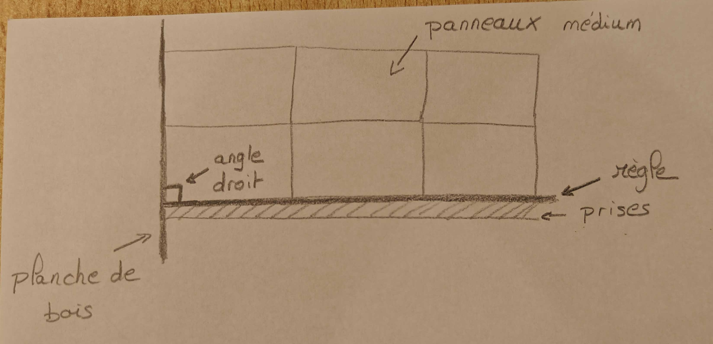

# Instructions for tomorrow

This document, dedicated to the installation of the fresco, is intended to be used by the team 1; 2; 5 and 6.

## Before starting

- Ask JP to give you one wooden plank from the storage room
- Use all the stuff displayed on the table in the library (glue, spatula, hair dryer, etc.) for the preparation of the panels (see below)

## 1. Clean the panels

To clean the panels, you will need:

- Remove all the glue/tape with a spatula and a hair dryer.
- With a wet rag, just humidify the panels to remove the dust and the remaining glue (No glue should remain on the panels).
- Erase all the pencil marks with a rubber to prepare the panels for the names of the students.

It's okay if it's not completed in the morning, the Deltas will be able to finish it.

## 2. Preparation of the setup for the installation

### Important information

Obviously, it will be the hardest and the longest part of the installation, so it will be mandatory to be very careful and to take your time to do it. Don't do it if you're less than 4 people, at least for starting the first chunk.

## 3. Installation of the fresco

To prepare the setup, it will be mandatory to use the metallic rule to be sure that the cubes are aligned with the panels and straight, then follow the steps below:

- Place the plank against the left side of the panel (entrance side) straight, you can use a bubble or laser level to be sure that the plank is parallel to the panel to the panel.
- Place the metallic rule under the panel, between the panel and the electric electric railing and make it perpendicular to the plank (once again, you can use a bubble or laser level to be sure that the rule is perpendicular to the plank). The following picture shows the setup:

- Glue the first part of the chunk and then place it against the plank and the rule. Once it's aligned, push it against the panel and press it for 15-20 seconds.
- Repeat the same process for the other parts of the chunk, then for the complete line.
- Once the first line is done, you can remove the metallic rule, because it's supposed to be straight, and then repeat the same process for the other lines.
