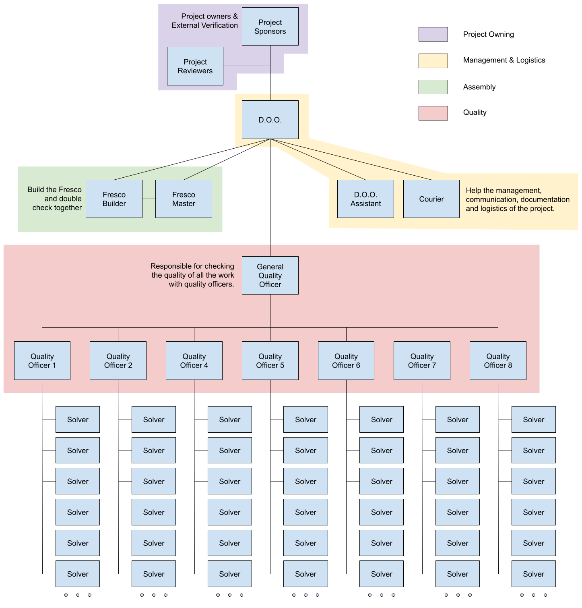
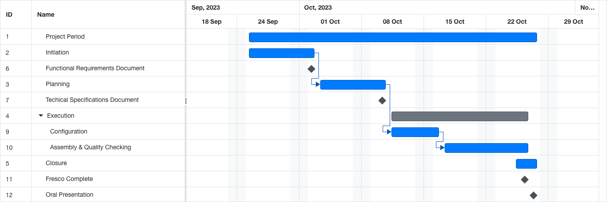

# Project Charter

## Document Control

### Document Information

| Document ID | Document # 4 |
|---|---|
| Document Owner | KAKAL Mathis |
| Issue date | Wednesday, October 18th 2023 - 09AM |
| Last Issue Date | Wednesday, October 18th - 8:24PM |
| Document Name | Project Charter |

### Document History

| Version | Issue Date | Changes |
|---|---|---|
| 0.1 | Wednesday October 18th, 2023 | Initial Release |

### Document Approval

| Role                                   | Name               |
|----------------------------------------|--------------------|
| Director of Operations/Project Manager | Clémentine Curel   |
| Project Manager Assistant              | Laura-Lee Hollande |
| Quality Manager                        | Mathis KAKAL       |
| Fresco Master                          | Alexis LASSELIN    |
| Fresco Builder & Software Developer    | Laurent BOUQUIN    |
| Courier                                | Victor Leroy       |

### Table of contents

- [Project Charter](#project-charter)
  - [Document Control](#document-control)
    - [Document Information](#document-information)
    - [Document History](#document-history)
    - [Document Approval](#document-approval)
    - [Table of contents](#table-of-contents)
- [Content](#content)
  - [Executive Summary](#executive-summary)
  - [Project Definition](#project-definition)
    - [Vision](#vision)
    - [Objectives](#objectives)
    - [Scope](#scope)
    - [Deliverables](#deliverables)
  - [Project Organisation](#project-organisation)
    - [Customers](#customers)
    - [Stakeholders](#stakeholders)
    - [Roles](#roles)
    - [Organisation Chart](#organisation-chart)
  - [Project Plan](#project-plan)
    - [Overall Plan](#overall-plan)
    - [Milestones](#milestones)
    - [Dependencies](#dependencies)
    - [Resource/Financial Plan](#resourcefinancial-plan)

# Content

## Executive Summary

This project originated from a call for tender from ALGOSUP to its students on October 2nd, 2023 to design the fresco that will be displayed at the entrance of the B3, the complex in which the school is located. 

The fresco in itself can be compared to a mosaic since it is made of small square pixels, more precisely Rubik's Cube facets, which adds an interesting aspect to the building of the fresco: the configuration of the cubes into the patterns that will make up the final design. 

The Fresco should measure between 60-100 square feet. 

In terms of organisation and planning, the project has been divided into multiple phases by the customer (ALGOSUP). 

- Project Initiation
  - During this phase, eight team of 6 students (in average) will compete to produce the best suggestion artwork for a fresco, as well as a Functional Specifications Document, to increase their understanding of the project and develop on many aspects and challenges that would come later on.
- Project Planning
- Project Execution
- Project Closure

In terms of Risks and Issues, we

- Circle the Wagon on what risks/threats could emerge and how to mitigate them (including)
  - Expansion due to climate changing because of seasons
  - Damaging the stuctural integrity of the wall because of drilling through it
  - Not having enough cubes after cube damage

Circle the wagon on the assumptions & Constraints

## Project Definition

### Vision

Our vision is to deliver a Fresco, that will speak both to the residents of the B3 (Students, Start-Ups, Staff etc.), Vierzon citizens and people from the region in general.

We are aiming to make a fresco that will, like most frescos in history be a testimony of the City's past, present and future.

We want our fresco to tell a "story" rather than represent a view, an image or a literal message.

We like the idea that this Fresco is one of the first things seen entering this building, and consider it as an important vector to convey a message to any new student or resident of the B3, as a warm welcome to the B3's vibrant culture.

Therefore a lot of attention will be put into the designing and making the fresco, as it will be seen by investors and many different stakeholders and has the power to deliver subconscious messages to them.

### Objectives

<!-- => Review with group -->

Build a fresco at the entrance of the school

With 2000-3000 rubiks cubes

Must be done by Thursday, 26th October

Including all the students in the process

Document the process (both by documenting and recording)

Anticipate the next steps to gain more responsibilities

### Scope

| ✅ | Must be done     |
|---|------------------|
| ❌ | Must not be done |

<!-- ask for more in scope items -->
| In Scope | Must | Would | Should | Code |
|---|---|---|---|---|
| The build must be durable (3 years minimum without deterioration) | ✅ | | | |
| The Fresco's palette will be limited by the cubes' colors (no printing on the cubes) | ✅ | | | |
| Fresco must feature 50 cubes (number of students in the school) that will feature the name of a student behind (as an easter egg) | ✅ | | | |
| The fresco must be put in the library | | ✅️ | | |

<!-- ask for more out of scope items -->

| Out of Scope | Must | Would | Should | Could |
|---|---|---|---|---|
| The fresco must not block the wall power outlets. | ❌ | | | |
| The fresco must not pose safety concerns with regards to fire hazards (plastic) and room clearance (evacuation). | ❌ | | | |
| The fresco must not block access to technical areas. | ❌ | | | |
| The fresco must not require entire displacement of the library (bookshelves and seats/couches). | ❌ | | | |
| The fresco must not block the sunlight coming into the library | ❌ | | | |
| The fresco must not feature graphic, shocking or discriminative elements. | ❌ | | | |

To help the stakeholders know what resources are going to be required to fulfil the project:
| Assumptions |
|---|
| We assume we will get the rubiks cubes at least two weeks prior to building |
| We will get customer communication and/or approval for the different steps |
| We assume we will be able to store various items things in our rooms. |
| We assume we will be able to store things in library |
| We assume we will be able to reorder the rooms to work more efficiently |
| We assume we can use the tracer for testing dimensions and designs, and that it functions and ink is provided |
| We assume we can drill into the library's walls |
| We assume the B3's safety committee will allows the construction of the Fresco. |
| We assume that we will be able to engage the customers' finances to buy the required material for this project |

<!-- ask the team about constraints -->

| Constraints |
|---|
| We only have 5 weeks |
| No clear team organisation is defined |
| Building won't start before halfway of the project, because of selection phase. |
| We aren't too experienced in such medium scale building. |
| We only have 6 colors to our palette |
| We are not experienced in Rubik's cube solving |
<!-- | ? | -->

Project Exclusions:
Cube interchangeability for redesigning frescos every year.

### Deliverables

| Name | Type | Deadline | Goal | Link |
|---|---|---|---|---|
| Functional Requirements Document | Document (pdf) | October 3rd, 2023 | Outlining the project, making sure students understood it, enabling people to define their objectives. | |
| Technical Specifications Document | Document (pdf) | October 10th, 2023 | Transforming the requirements from the Functional Specs into concrete feasible steps. | |
| Fresco Design | Image (png) | October 10th, 2023 | Deliverable for the selection process to begin. | |
| Team Management & Quality Assurance Document | Document (pdf) | October 10th, 2023 | To outline the management of the project and the strategy to ensure timely completion as well as quality of work. | |
| Weekly Report | Document (markdown) | October 27th, 2023 | The goal of the weekly report is to provide better monitoring of the project by tracking weekly and/or daily activities with performance indicators and group discussions. This is useful for both the team for continuous improvement, but also for the customer for greater transparency. | |
| Handing Over | Document (markdown) | October 10th, 2023 | This document intends to prepare the team to the eventuality of a management change (change management). | |
| Budget Plan | Document (markdown) | October 10th, 2023 | The goal of the budget plan is to help the team(s) anticipate and validate the costs of the upcoming work with the customers, before engaging further expenses. | |
| Provisional Planning | (Google Sheets (screenshot of)) | October 10th, 2023 | Much like the budget plan, the provisional planning aims to anticipate the amount of time spent on each defined task in order test feasibility and timeliness of the project. | |
| Glueing Process | Document (markdown) | October 18th, 2023 | The goal of this Document is to explain the cube glueing process to ensure minimal discrepancy among groups. | |
| Fresco Documentary | Video (mp4) | October 27th, 2023 - 9A.M. | There are multiple benefits and goals to the creation of a documentary tracing the whole process of building the fresco. Potential uses could be: Advertisement on social media, archival purposes, Onboarding new students, serve as an example for the conduct of a project, add an easily recognisable media to the school's culture, allow students to share their stories to their family/relatives/friends. | |
| Movie Rushes | Videos (undefined) | October 27th, 2023 - 9A.M. | Provide the customer with as much recorded footage as possible to allow them to create their own content with it. | |
| Video Tutorials | Videos (hosted on youtube) | UNDEFINED | How to tape two cubes together etc. | |

## Project Organisation

### Customers

Here is a list of the project's customers, to whom all of the work is intended for, and whom will provide us with feedback and guide us towards crafting a better product.
| Customer | Representative |
|---|---|
| **Franck JEANNIN** *(project sponsor)* | himself |
| **Natacha BOEZ** *(project sponsor)* | herself |
| Jean-Philippe GRASSE | himself |
| Markus ADAMS | himself |

 The Project Sponsors (highlighted in **bold**) are expected to be in charge of:

- Defining the vision and high level objectives for the project
- Approving the requirements, timetable, resources and budget
- Authorising the provision of funds / resources (internal or external)
- Approving the project plan and quality plan
- Ensuring that major business risks are identified and managed
- Approving any major changes in scope
- Receiving Project Review Group minutes and taking action accordingly Resolving issues escalated by the Project Manager / Project Review Group
- Ensuring business / operational support arrangements are put in place
- Ensuring the participation of a business resource (if required)
- Providing final acceptance of the solution upon project completion.

### Stakeholders

Here is a list of the stakeholders, whom may be external to the project, but might still be interested in it. 
| Stakeholder | Interested In |
|---|---|
| ALGOSUP Students | ...having a Fresco that represents them and the culture they are part of at ALGOSUP |
| Eric L'Archevêque | ...seeing where his investments go. |
| CNAM/Campus Connecté | ...understanding what they are part of. |
| B3 Village | ...in seeing what the students from downstairs are up to. |
| Cleaning Staff | ...in having a fresco that doesn't make their work harder. |
| Crédit Agricole | ...seeing that projects and students they fund adhere to the same local development values as them. |
| B3 Security Committee | ...in making sure that anything that happens in the B3 stays withing their security guidelines. |
| Pedestrians | ...in the rich history of this massive building. |
| Vierzon Tourism Office/Vierzon's Museum | ...in seeing the continuity between the city's past and its future. |
| Neighbouring Shops | ...in seeing what kind of activity the B3 might pull. |
| Vierzon's Townhall | ...in the message that this massive investment is giving off. |

### Roles

This is a list of all the defined roles of the project.
| Role | Description | Name | Team | Assignment date |
|---|---|---|---|---|
| Director of Operations (DOO) | Main project management, observation, and decision making | Clémentine CUREL | 3 | October 10th, 2023 |
| Project Management Assistant | Delegated (DOO) work and Documentation | Laura-Lee HOLLANDE | 3 | October 10th, 2023 |
| Fresco Master | In charge of all the material aspects of building the fresco including construction and logistics. In charge of all quality aspects of the cube's assembly (phase 2) | Alexis LASSELIN | 3 | October 10th, 2023 |
| Fresco Builder & Software Developer | In charge of building the Fresco & developing the internal software needs | Laurent BOUQUIN | 3 | October 10th, 2023 |
| Courier | In charge of delivering resources and ensuring communication between all groups. Serves as a bridge for communication | Victor LEROY | 3 | October 10th, 2023 |
| General Quality Officer & Designer | In charge of conceiving and appying quality assurance protocols & producing the group's visuals (static or motion pictures). Is in charge of all quality aspects of the cube's configuration (phase 1). | Mathis KAKAL | 3 | October 10th, 2023 |
| Team 1 Quality Officer | In charge of Team 1's quality. | Pierre GORIN | 1 | October 10th, 2023 |
| Team 2 Quality Officer | In charge of Team 2's quality. | Léo CHARTIER | 2 | October 10th, 2023 |
| Team 4 Quality Officer | In charge of Team 4's quality. | Jason GROSSO | 4 | October 10th, 2023 |
| Team 5 Quality Officer | In charge of Team 5's quality. | Camille GAYAT | 5 | October 10th, 2023 |
| Team 6 Quality Officer | In charge of Team 6's quality. | Mathias GAGNEPAIN | 6 | October 10th, 2023 |
| Team 7 Quality Officer | In charge of Team 7's quality. | Guillaume DESPAUX | 7 | October 10th, 2023 |
| Team 8 Quality Officer & Pizza Master | In charge of Team 8's quality. | Thibaud MARLIER | 8 | October 10th, 2023 |

<!-- ### Project Reviewers

no content here... -->

### Organisation Chart

## Project Plan

The project mainly features 4 phases:
**Initiation**
**Planning**
**Execution**
*Cube Configuration*
*Cube Assembly*
**Closure**

### Overall Plan

Here is a simplified view of the project in terms of phases and critical deliverables 

### Milestones

The main Milestones we have identified are
| Milestone | Deadline |
|---|---|
| Completion of the Functional Requirements Document | October 3rd, 2023 |
| Completion and selection of the Fresco Design | October 10th, 2023 |
| Completion of The Technical Specifications Document | October 10th, 2023 |
| Reception and Integral inspection of the cubes | October 11th, 2023 |
| Completion of the Management Plan | October 11th, 2023 |
| Completion of the Quality Assurance Plan | October 11th, 2023 |
| Completion of the first chunk | October 12th, 2023 |
| Completion of the first Slice | October 12th, 2023 |
| Completion of all the chunks | October 13th, 2023 |
| Quadruple Verification of all the blocks (not at once but cumulated) | October 20th, 2023 |
| Completion of the first fresco plank | October 20th, 2023 |
| Completion of all the planks | October 24th, 2023 |
| Assembly of the first plank on the Wall | October 24th, 2023 |
| Final assembly of the Fresco and final verification | October 26th, 2023 |
| Delivery of the oral presentation | October 27th, 2023 |
| Inauguration of the Fresco | October 27th, 2023 |

### Dependencies

The four the phases mentioned above are successive and dependant on each other.
The only external factor that may impact (delay) execution and closure phases is printer Ink, Rubik's cubes, and plank delivery.

The Criticality of those dependencies is high, as the project cannot be delivered without them.

### Resource/Financial Plan

As students, we are paid in *experience points*
Apart from that, the project will require several expenses from the customer for various materials required in the construction of the Fresco, as follows:
The capital expenditures are listed in the budget plan (listed in the *project deliverables above*)

<!-- ### Risks

 ask the others -->
