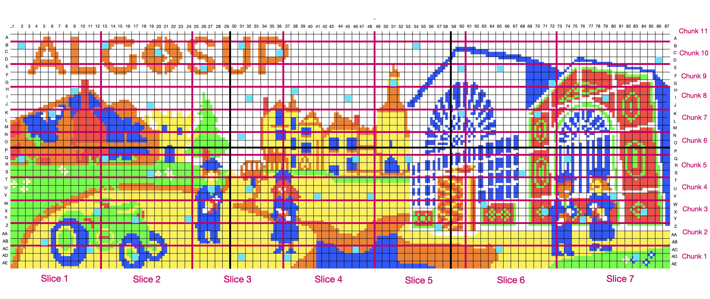
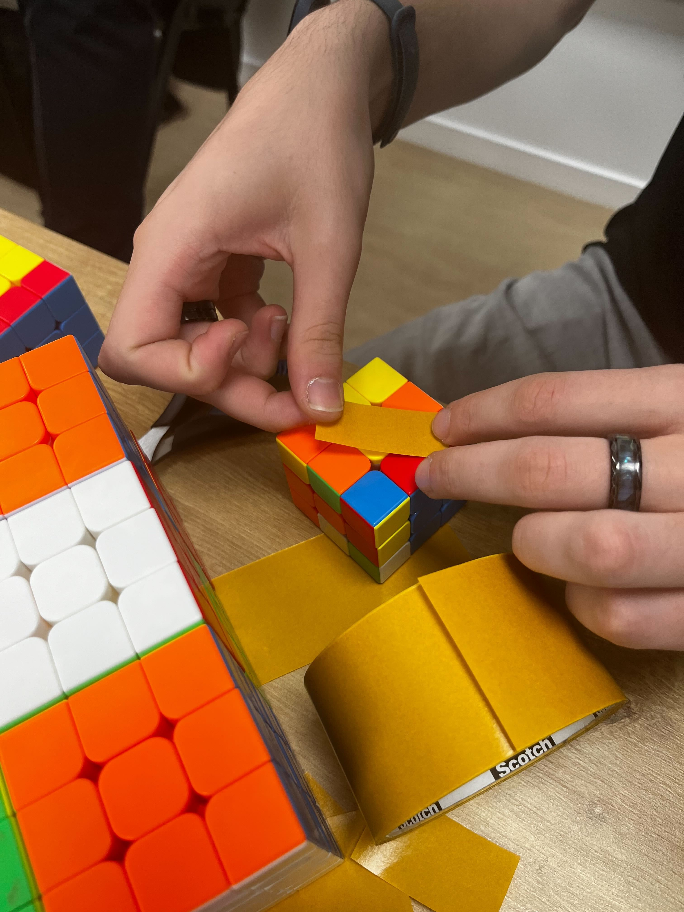
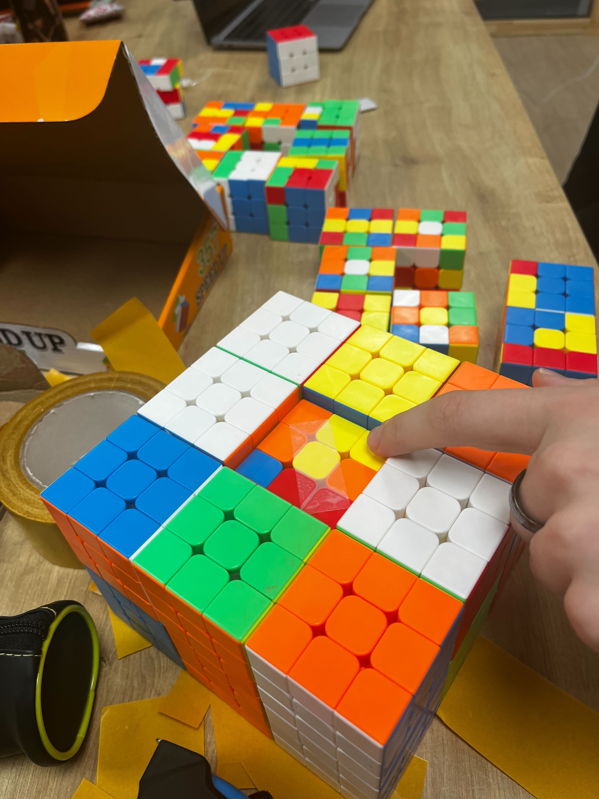
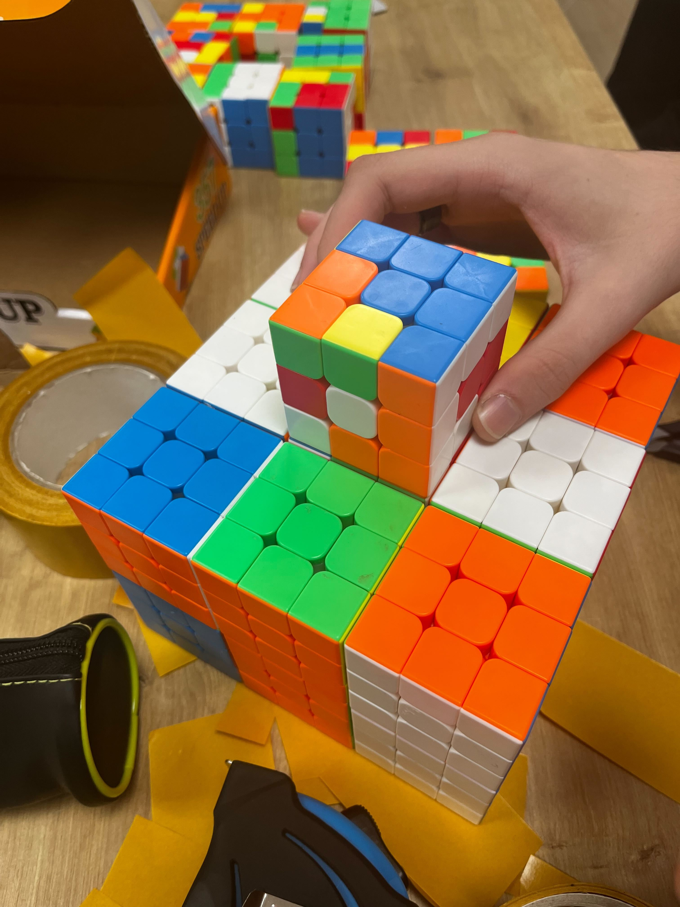
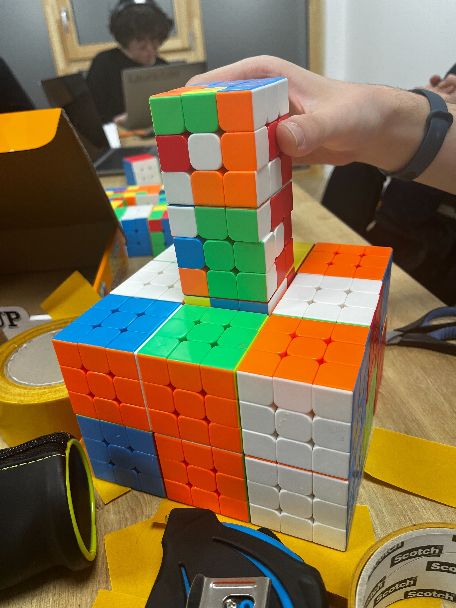
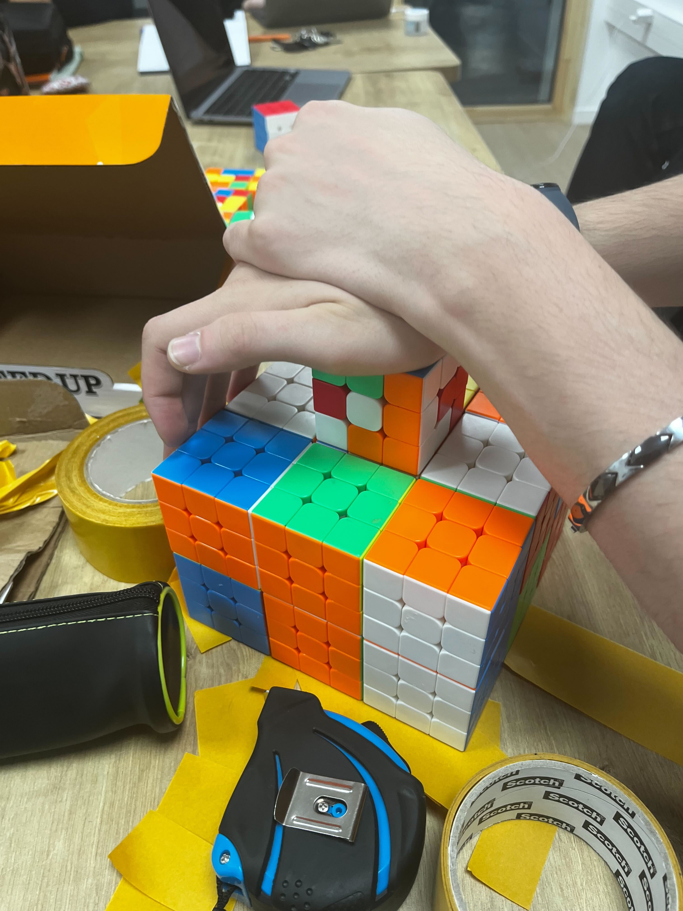
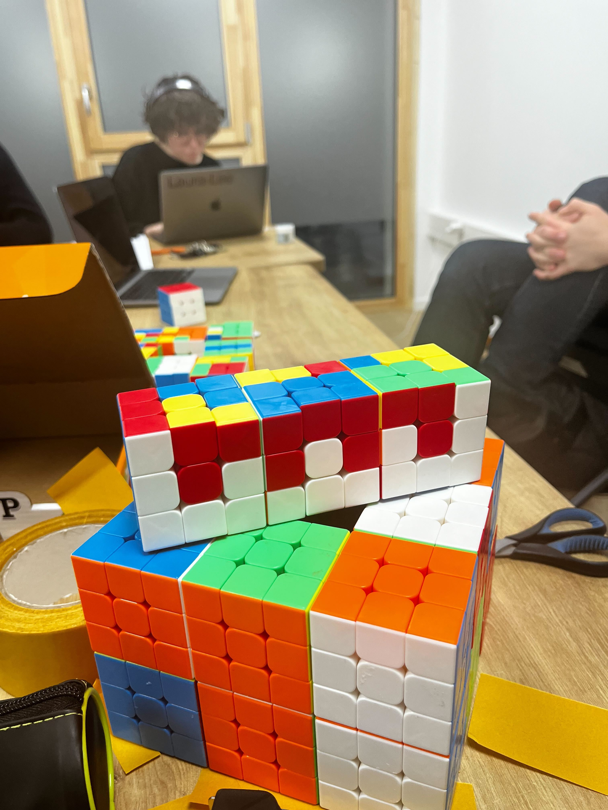

# Gluing process - Team 3

- [Gluing process - Team 3](#gluing-process---team-3)
  - [Overview](#overview)
  - [Reminder](#reminder)
  - [Materials provided](#materials-provided)
  - [Process](#process)
    - [Scheme](#scheme)
    - [Requirements](#requirements)
    - [Doule-sided tape](#doule-sided-tape)
      - [Dimension](#dimension)
      - [Use of the mold](#use-of-the-mold)
      - [Precisions](#precisions)
      - [Store](#store)
  - [Troublesshooting](#troublesshooting)

## Overview

This document will provide your teams with the essential steps and instructions to glue the cubes together and **should be read before starting to minimize errors.**

## Reminder

- Each group is responsible for its chunk and its cubes.
- 50 randomly located cubes should be removable from the fresco with the name of one student hidden behind each cube.
- The cubes should be glued together using the double-sided tape provided by Team 3.
- The pattern on the cubes don't have to be changed.

## Materials provided

- One roll of double-sided tape (25m) per group.
- A mold to ensure the cubes a straight during the taping.
- The rubik's according to their slice.

## Process

### Scheme

- The blue cubes represent the 50 cubes with the name of the students.

### Requirements

- The cubes must be properly aligned.
- Once assembled, the cubes should form a compact block.
- Use one piece of tape for each cube.
- 1 box of cubes correspond to one bloc of glued cube.

### Doule-sided tape

#### Dimension

The pieces of tape should measure approximately 2.5cm in width and 5cm in length.

#### Use of the mold

[Tutorial video](https://youtu.be/NkQtOh_3EXg?si=_nOc0ZW8SRY_Rldn) (less than two minutes).

- Step 1 : Put the double-sides tape on the cube.
  

- Step 2 : Put the cube in the mold

- Step 3 : Do the same with the two following cubes.

- Step 4 : Compact.

- Step 5 : Admire.

#### Precisions

One piece of double-sided tape will be placed diagonally on the cube faces.

- Please, follow the following scheme to place the double-sided tape:

- The violet lines correspond where the double-side tape should be glue.

``The face where the pattern is created, the one opposite to it and the blue cube on the schema should not have any double-sided tape.``

#### Store

When finishing, store the block in their respective box.

## Troublesshooting

- If the tape starts coming off too much, use a new one.
- The tape should not extend onto the other faces.
