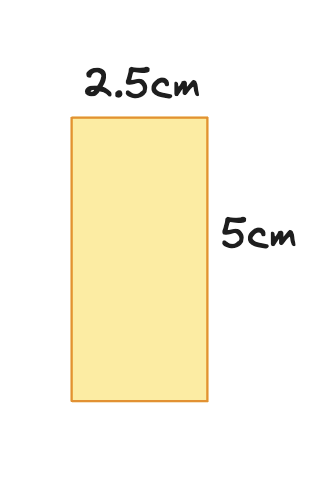
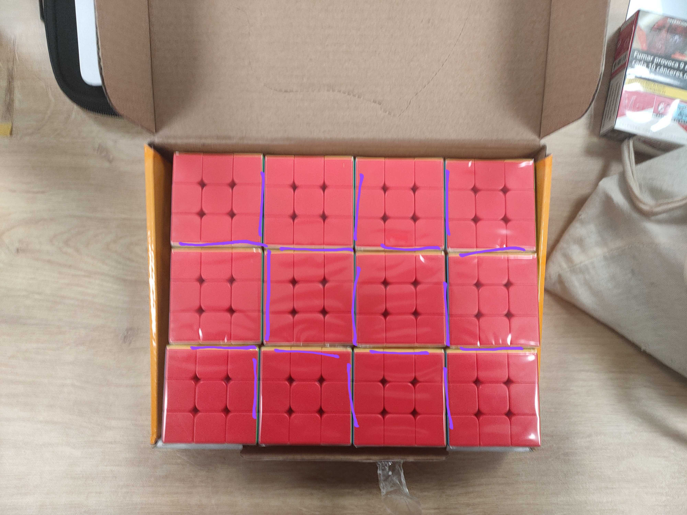

# Gluing process - Team 3

- [Gluing process - Team 3](#gluing-process---team-3)
  - [Overview](#overview)
  - [Reminder](#reminder)
  - [Materials provided](#materials-provided)
  - [Process](#process)
    - [Scheme](#scheme)
    - [Requirements](#requirements)
    - [Doule-sided tape](#doule-sided-tape)
      - [Dimension](#dimension)
      - [Use of the mold](#use-of-the-mold)
      - [Use](#use)
  - [Troublesshooting](#troublesshooting)

## Overview

This document will provide your teams with the essential steps and instructions to glue the cubes together and **should be read before starting to minimize errors.**

## Reminder

- Each group is responsible for its chunk and its cubes.
- 50 randomly located cubes should be removable from the fresco with the name of one student hidden behind each cube.
- The cubes should be glued together using the double-sided tape provided by Team 3.
- The pattern on the cubes don't have to be changed

## Materials provided

- One roll of double-sided tape (25m) per group
- A mold to ensure the cubes a straight during the taping

## Process

### Scheme

- The blue cubes represent the 50 cubes with the name of the students.

### Requirements

- The cubes must be properly aligned
- Once assembled, the cubes should form a compact block
- Use one piece of tape for each cu√be

### Doule-sided tape

#### Dimension

The pieces of tape should measure approximately 2.5cm in width and 5cm in length.

#### Use of the mold

#### Use

One piece of double-sided tape will be placed diagonally on the cube faces.

Follow the following scheme to place the double-sided tape:

- The violet lines correspond where the double-side tape should be glue.

``The face where the pattern is created, the one opposite to it and the blue cube on the schema should not have any double-sided tape.``

## Troublesshooting

- If the tape starts coming off too much, use a new one.
- The tape should not extend onto the other faces

