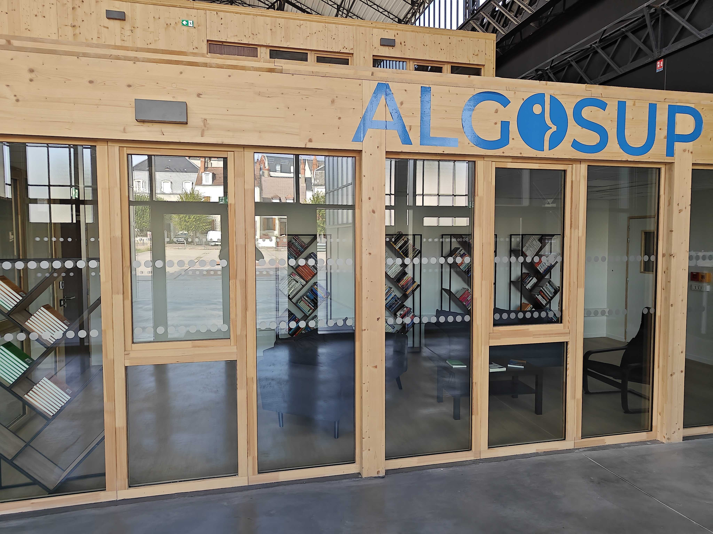
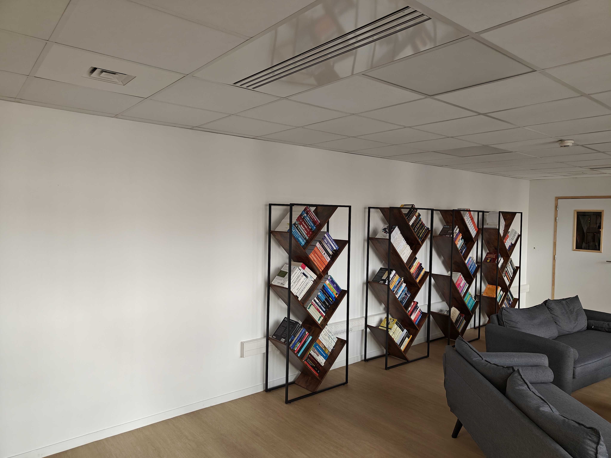
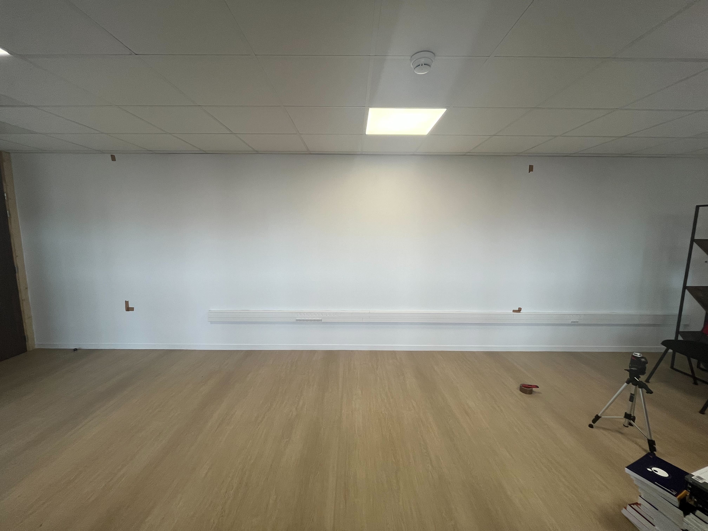
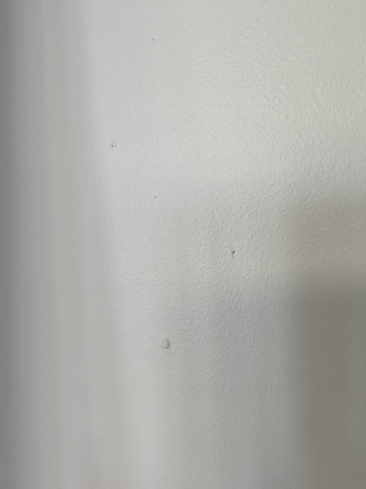
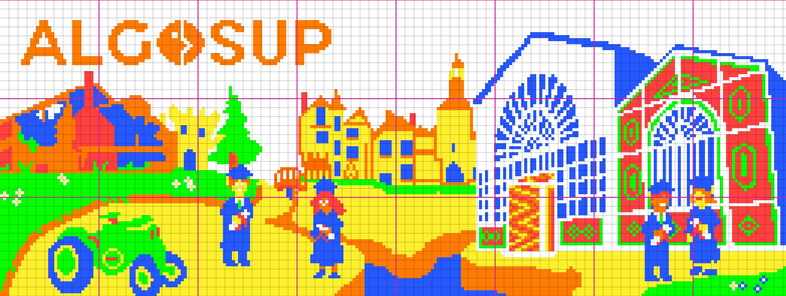

# Technical Specifications - Team 3

- [Technical Specifications - Team 3](#technical-specifications---team-3)
	- [Room configuration](#room-configuration)
		- [Problems](#problems)
	- [Timelaspe](#timelaspe)
	- [Rubik's cubes configuration](#rubiks-cubes-configuration)
	- [Transport](#transport)
	- [Set up](#set-up)
		- [Library setup](#library-setup)
		- [Fresco set up](#fresco-set-up)
	- [Removal](#removal)
	- [Python Coding Conventions and Best Practices (PEP 8)](#python-coding-conventions-and-best-practices-pep-8)
		- [Code Layout](#code-layout)
			- [Indentation](#indentation)
			- [Maximum Line Length](#maximum-line-length)
			- [Imports](#imports)
		- [Whitespace](#whitespace)
		- [Naming Conventions](#naming-conventions)
		- [Comments](#comments)
		- [Function and Method Signatures](#function-and-method-signatures)
		- [Coding Style](#coding-style)
	- [Software](#software)
		- [Purpose](#purpose)
		- [Key features](#key-features)
			- [Image Analysis](#image-analysis)
			- [Pixel-to-Cube Mapping](#pixel-to-cube-mapping)
			- [Visualization](#visualization)
			- [Graphical User Interface (GUI)](#graphical-user-interface-gui)
			- [Color Selection](#color-selection)
		- [Usage](#usage)
			- [Image Input](#image-input)
			- [Face Selection](#face-selection)
			- [Color Customization](#color-customization)
			- [Mosaic Generation](#mosaic-generation)
			- [Display](#display)
		- [Limitations](#limitations)
		- [System Requirements](#system-requirements)
		- [Librairies](#librairies)
		- [Open source](#open-source)
	- [File structure](#file-structure)
	- [Architecture diagram](#architecture-diagram)
	- [Risks](#risks)
	- [Tests](#tests)
	- [Security](#security)
	- [Contact](#contact)
	- [Sources](#sources)
	- [Glossary](#glossary)

## Room configuration

The room is a rectangle of 8.3m in length and 3.8m in width. The wall is 2.5m in height.

According to the following pictures, the fresco will be placed against the white wall to be seen from the outside, or at least from the entrance of the building.





The size of the fresco is delimited by the tape of the wall.



### Problems

There is a problem with the wall. With a bubble level, we found that the wall was not perfectly straight. The wall is inclined of 1cm from the top to the bottom. This problem is minor, but it will be necessary to take it into account when placing the cubes.

Another problem is the presence of roughness on the wall. It's important to notice it when we will place the tape on the wall.



And last but not least, the fact that even inside the B3 (outside the library), the upper part of the fresco is barely visible to those looking at it, which is why we had to load the upper part as little as possible, so as to lose as few details as possible, but also to change the contrast between the filled lower part and the empty upper part.

## Timelaspe

To record the timelapse, we will use a GoPro 3 owned by one of our team member.

The timelapse record will last all the project. Starting from our first project hour, and will last until the fresco is finished.

We will be recording the different groups building the fresco, with their agreement, we could also record them doing the Rubik's cubes in their rooms, then follow them transporting the cubes to the library.

The point of this timelapse will be to show to the other groups and keep memory of what we built, it will also be an interesting communication point for the school on social medias.

The editing of the timelapse will be done with iMovie.

## Rubik's cubes configuration

To create the fresco, we need to know exactly how every face on the fresco will look like, that's why in the [Software](#software) section, we will explain how we created a software that, with an image in input, outputs the configuration of the Rubik's cube of your choice.

The Rubik's cubes will be placed on the wall with double-sided tape, the tape will be placed on the corners of the rubik's cubes, making a big grid on the wall. Each tape will stick 4 cubes in one time, reducing the amount of tape used.

## Transport

The transfer between the project rooms and library will be done in 2 steps, the first one consisting on writing the coordinates of the place where the cube should be on the fresco with a pencil, in order to simplify the process if a cube is lost during the transport, it will be written on the opposite cube face of the one exposed in the fresco. The second step will be to take a cardboard to bring the cubes in the library.

## Set up

### Library setup

To prepare the library for the Rubik's cubes arrival, a grid will be drawn with a pencil on the wall.

The squares on the grid will have a size of 5.6 x 5.6 cm each, which is the size of a Rubik's cube. On each square, the number of the case will be written to easily find the right place for the Rubik's cubes.

The same grid should be drawn on the printed fresco to have a reference for the actual fresco.

### Fresco set up

The first step of the fresco set up will be to start from the bottom.

The eight groups will have to configure the Rubik's cubes of the line AG and then AF to the top.

To stick all the Rubik's cubes to the wall double-sided foam tape will be placed at each corner of the Rubik's cubes. The tape should touch 4 Rubik's cubes at the same time.

It should not have any tape in the middle of the Rubik's cubes because the middle face is magnetic.

There are some imperfections on the wall to avoid having a Rubik's cube not align with the others, the tape should not be placed on these imperfections.



We chose not to use any glass or plexiglass to avoid reflections from the outside. This choice also reduces the weight of the wall.
On a more practical note, the use of scotch tape makes it easy to adapt or change the fresco.

## Removal

When the fresco will be removed or changed, it will probably leave some tape or marks on the wall. Removing the tape without damaging the wall will require a hair dryer.

- Heat the corners and edges of the adhesive to soften the glue,
- Peel it off using a card or a spatula from the edge,
- Heat again if it doesn't peel off,
- If there is some glue left on the wall, use a sponge soaked in soapy water.

## Python Coding Conventions and Best Practices (PEP 8)

Our code will outline the coding conventions and best practices for writing Python code, according to the Python Enhancement Proposal 8 (PEP 8). Following these guidelines ensures code consistency and readability, making it easier for developers to collaborate on the project.

### Code Layout

#### Indentation

- Use 4 spaces for indentation levels, not tabs.

```py
# Correct:

# Aligned with opening delimiter.
foo = long_function_name(var_one, var_two,
                         var_three, var_four)

# Add 4 spaces (an extra level of indentation) to distinguish arguments from the rest.
def long_function_name(
        var_one, var_two, var_three,
        var_four):
    print(var_one)

# Hanging indents should add a level.
foo = long_function_name(
    var_one, var_two,
    var_three, var_four)
```

```py
# Wrong:

# Arguments on first line forbidden when not using vertical alignment.
foo = long_function_name(var_one, var_two,
    var_three, var_four)

# Further indentation required as indentation is not distinguishable.
def long_function_name(
    var_one, var_two, var_three,
    var_four):
    print(var_one)
```

#### Maximum Line Length

- Limit lines to a maximum of 79 characters for code and comments.
- For long lines, break lines at a suitable point and continue on the next line with a 4-space indentation.

#### Imports

- Import standard library modules first, followed by third-party libraries, and finally your project's modules.
- Separate import groups with a blank line.
- Avoid wildcard imports (`from module import *`) as they can lead to namespace pollution.

### Whitespace

- Use blank lines to separate functions, classes, and blocks of code within functions.
- Surround operators with a single space on each side (e.g., `x = 10`, not `x=10`).
- Avoid extraneous whitespace at the end of lines.

### Naming Conventions

- Use `lowercase_with_underscores` for variable and function names.
- Use `CamelCase` for class names.
- Use `UPPERCASE` for constants.
- Prefix non-public attributes and methods with a single underscore (e.g., `_private_variable`).
- Avoid using single-character variable names, except for temporary variables (e.g., `i`, `j`, `x`, `y`).

### Comments

- Use descriptive variable and function names to minimize the need of comments.
- Write comments in clear, concise English.
- Use docstring to document classes, functions, and modules.
- Keep comments up to date with the code they describe.

### Function and Method Signatures

- Use meaningful parameter names.
- Include type hints for function and method arguments and return values.
- Use default values for optional function arguments instead of mutable objects (e.g., lists or dictionaries).

### Coding Style

- Follow the [Zen of Python (PEP 20)](https://peps.python.org/pep-0020/) principles.
- Be consistent with your code style throughout the project.
- Use spaces around operators for clarity.
- Use parentheses to clarify the order of operations, even if they are not required.

For detailed guidelines and additional recommendations, refer to the full PEP 8 document at [PEP 8, Style Guide for Python Code](https://peps.python.org/pep-0008/).

## Software

The project aims to develop a Python-based tool to simplify the creation of Rubik's Cube frescoes. The tool will analyze an input image, identifie the color information for each cube on the Rubik's Cube, and generate the corresponding output image.

This solution will be open source and designed to be compatible with both macOS and Windows operating systems.

It will develop in Python and relie on several libraries for image processing and graphical user interfaces.

### Purpose

The primary purpose of the Rubik's Cube Fresco Creation Tool is to convert an input image into a mosaic pattern that can be recreated on a Rubik's cube. Users can select a specific Rubik's cube face (e.g. G23) and generate the corresponding pattern for that face.

The software should save the output image in the same folder as the input image and should be named `cube.png`.
If a `cube.png` file already exists, it should be replaced by the new one.

By selecting the grid name you want to check, the program will return an image of the face that will have to be at this address on the pixel art.

If the image's size can"t be divided by 3, it will mean that the size is not right, and it should return an error written in the `lastest.log` file.

### Key features

#### Image Analysis

The tool will support input images in various formats, and it can analyze the color of each pixel in the image.
Need to check if the image dimensions are suitable for creating a Rubik's cube mosaic (i.e., divisible by 3).

#### Pixel-to-Cube Mapping

The tool will map each pixel in the input image to the corresponding location on the Rubik's cube face based on the user's selection.
Users can specify the target Rubik's cube face using classic formats such as A1, B2, or C3.

#### Visualization

The software will provide a visual representation of the mosaic for the selected cube face.
It generates a new image with the Rubik's cube colors and can rotate it to align with the cube's orientation.

#### Graphical User Interface (GUI)

The tool need to include a user-friendly GUI that will allow users to input their preferences and view the resulting mosaic.
It features an input field for specifying the cube face, making it easy for users to select the desired face.

#### Color Selection

The GUI need to offer a color selection feature that allows users to choose the colors for each Rubik's cube face from a predefined palette.

### Usage

#### Image Input

Users can provide an input image, and the tool will verify its dimensions for compatibility.

#### Face Selection

Users specify the target Rubik's cube face using classic formats (e.g., A1, B2, C3).

#### Color Customization

Users can customize the colors for each face using the GUI, allowing for creative and unique Rubik's cube mosaics.

#### Mosaic Generation

The tool processes the image and generates a mosaic pattern that corresponds to the selected cube face.

#### Display

Users will be allow to have a look on the the mosaic in the GUI, making it easy to assess and adjust the design as needed.

### Limitations

The software may have limitations related to image size and format, so users are encouraged to adhere to recommended image guidelines.
Complex images with fine details may not translate perfectly to Rubik's cube mosaics, and some manual adjustments may be required.

### System Requirements

- Python Version
The software will be written in [Python 3.10.11](https://www.python.org/downloads/release/python-31011/)

- Operating Systems
The software will be compatible with macOS and Windows.

As it was decided by the group, the software will be open source to allow other people or co-workers to speed-up their work.

### Librairies

To develop this software, we will use libraries that are:

- [Pillow](https://pypi.org/project/Pillow/) version 9.4.0: a library that manage images that will be useful to create the output image or to separate the pixels of the input image.
- [Sys version](https://docs.python.org/3.12/library/sys.html): The sys library is meant to allow the program to return system errors when a problem occurs.
- [Datetime](https://pypi.org/project/DateTime/) version 5.2: This library allows the program to get the exact date and time and will serve when an error occurs to return the exact time of the error in the "lastest.log" file.
- [Wxpython](https://wxpython.org/pages/downloads/index.html) version 4.2.1: It is a library that is used to render Graphical User Interfaces (GUI). We will use it to make our software more user friendly.

### Open source

We use an open source software developed by a team's member.

You can find our project on GitHub at the following repository: [2023-2024-project-1-rubiks-art-team-3](https://github.com/AlexisLasselin/2023-2024-project-1-rubiks-art-team-3)

## File structure

	project-1-rubiks-art-team-3/
	└── Code/
		├── rubik.py
		├── Image.png
		├── cube.png
		├── part.png
		└── lastest.log

## Architecture diagram


## Risks

- Wall not straight -> Use a bubble level to verify -> The wall is a bit inclined but it will works.
  
|Another risk to take in account is the total weight of the fresco on the wall, the fresco is composed of 2871 cubes, each one is 64 grams. It means that the total weight on the wall is 183744 grams, which is 183.744 kg. The wall is, on the paper, able to support 200 kg, but we don't know if it's true. To avoid any problem, we will put the fresco on the wall line by line, and we will check if the wall is not damaged by the weight of the fresco.

## Tests
<!-- size rubik -->
<!-- The graphical user interface, or GUI (/ˌdʒiːjuːˈaɪ/ JEE-yoo-EYE[citation needed] or /ˈɡuːi/[1][2] GOO-ee), is a form of user interface that allows users to interact with electronic devices through graphical icons and audio indicators such as primary notationquality assurance of the other groups -->
<!-- test of the program -->
<!-- link to the mana doc -->
To ensure the proper functioning of the program, you can find a Test plan on our [GitHub](https://github.com/AlexisLasselin/2023-2024-project-1-rubiks-art-team-3/tree/main)

/<!-- To ensure proper installation of the fresco, there is a [documentation](#) in pdf where you can find how to use our program, how the fresco will be set up with all the details. -->

## Security

This solution must not affect the security of other services, and systems.

The privacy of the users being very important, we decided to not save any kind of data in our programs.

## Contact

If you have questions during the project, you can contact the members of the teams depending of yours questions.

|Name|Mail|Domain relate|
|----|----|------|
|Clémentine Curel|clementine.curel@algosup.com|Management|
|Laura-Lee Hollande|laura-lee.hollande@algosup.com|Management|
|Mathis Kakal|mathis.kakal@algosup.com|Design|
|Victor Leroy|victor.leroy@algosup.com|Rubik's cubes|
|Laurent Bouquin|laurent.bouquin@algosup.com|Programs|
|Alexis Lasselin|alexis.lasselin@algosup.com|Programs, Rubik's cubes|

## Sources

[GitHub project](https://github.com/AlexisLasselin/2023-2024-project-1-rubiks-art-team-3/tree/main)

## Glossary

|Word|Definition|Source|
|-|-|-|
|PEP| A PEP is a document that describes new features proposed for Python and documents aspects of Python, like design and style, for the community.|[RealPython](https://realpython.com/python-pep8/#:~:text=The%20primary%20focus%20of%20PEP,and%20style%2C%20for%20the%20community.)|
|PEP 8|The primary focus of PEP 8 is to improve the readability and consistency of Python code.|[PEP 8 – Style Guide for Python Code](https://realpython.com/python-pep8/#:~:text=The%20primary%20focus%20of%20PEP,and%20style%2C%20for%20the%20community.)|
|GUI|The graphical user interface, or GUI, is a form of user interface that allows users to interact with electronic devices through graphical icons and audio indicators such as primary notation, instead of text-based UIs, typed command labels or text navigation.| [Wikipedia](https://en.wikipedia.org/wiki/Graphical_user_interface) | (edited)
20|The Zen of Python is a collection of 19 "guiding principles" for writing computer programs that influence the design of the Python programming language.|[PEP 20 – The Zen of Python](https://en.wikipedia.org/wiki/Zen_of_Python)|
|GUI||iMovie|iMovie is an editing software designed for iOS and MacOS, it allows the user to organize, edit and|GitHub|GitHub is a code hosting platform for version control and collaboration.|[GitHub](https://github.com/)|

|Open source|Open source is source code that is made freely available for possible modification and redistribution.|[Wikipedia](https://en.wikipedia.org/wiki/Open_source#:~:text=Open%20source%20is%20source%20code,model%20that%20encourages%20open%20collaboration.)|
|License|A software license tells others what they can and can't do with your source code, so it's important to make an informed decision.|[License](https://docs.github.com/en/repositories/managing-your-repositorys-settings-and-features/customizing-your-repository/licensing-a-repository)|
|Timelaspe|A timelapse is a video that is usually played at a higher speed than normal, allowing the viewer to see processes that take a long time in a short period of time.|[Wikipedia](https://en.wikipedia.org/wiki/Time-lapse_photography)|
