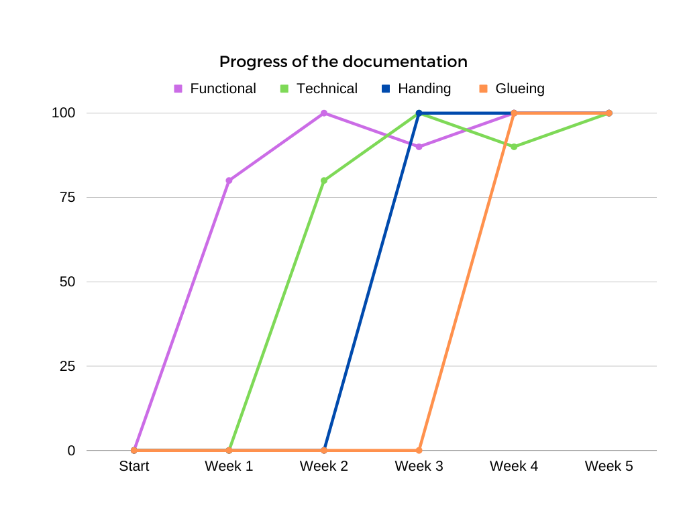
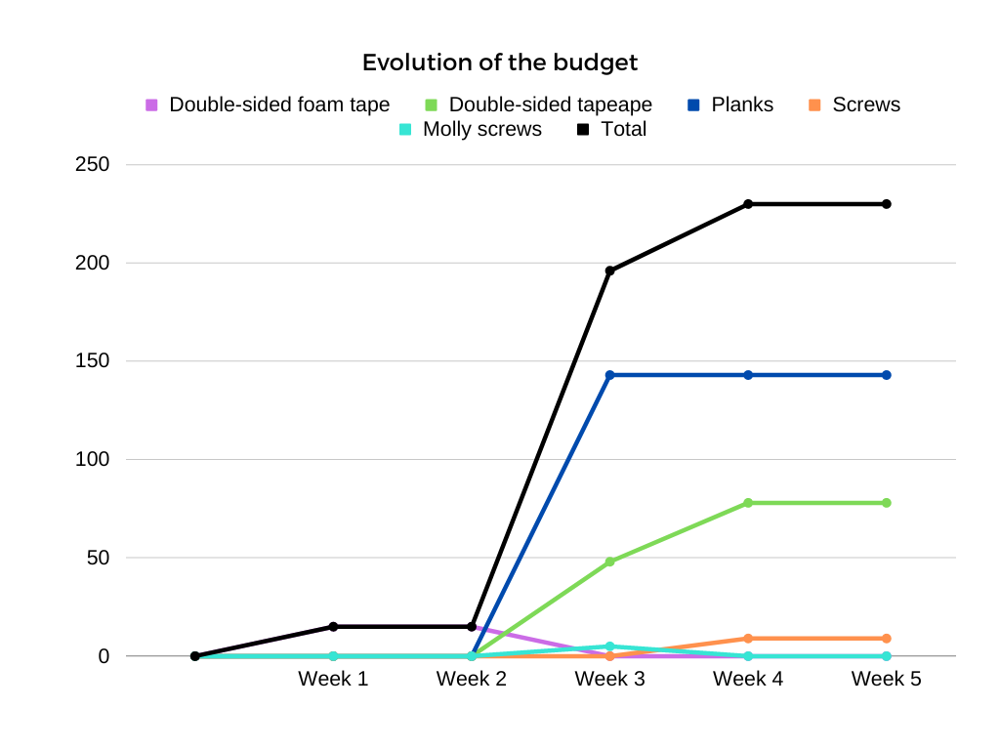
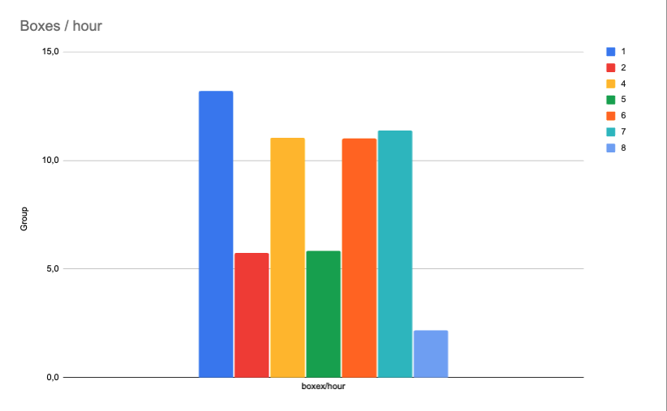

# Weekly Report of Team 3

```

Task name

Description. Status of the task.

Accomptable people. 

|Time allocated|Time needed|Deadline|
|-|-|-|
|X|X|X|

```

<span style="color:green">In time</span>,

<span style="color:orange">Delay of less than one day</span>,

<span style="color:red">Delay of more than one day</span>.

# Week 1 - 09/25/2023 - 09/29/2023

## Brainstorm of the fresco design

Mix all the best ideas to create a schema of the wanted fresco. Name the person responsible for the fresco design.

Done.

All the team.

|Time allocated|Time needed|Deadline|
|-|-|-|
|Half a day|Half a day|<span style="color:green">09/28/2023</span>|

## Analyse of the Rubik's cubes

Deep analysis of Rubik's cubes. Get the size, the weight, and the colours (in Hexa).

Done.

Laurent Bouquin & Alexis Lasselin.

|Time allocated|Time needed|Deadline|
|-|-|-|
|Half a day|A day|<span style="color:green">09/28/2023</span>|

## Analyse of the library

Deep analysis of the library. Get the measurements, the furniture placement, the wall cant.
It took time because we needed to get a meter and a bubble level.

Done.

Laurent Bouquin & Alexis Lasselin.

|Time allocated|Time needed|Deadline|
|-|-|-|
|A day|A day|<span style="color:green">09/29/2023</span>|

## Brainstorm of the fresco fixation

Mix of all the best ideas to create a schema.

Done.

All the team.

|Time allocated|Time needed|Deadline|
|-|-|-|
|A day|A day|<span style="color:green">09/29/2023</span>|

## Creation of the functional specifications

Creation and addition of all the functional parts of the project. 
It took more time than needed because of the last-minute updates.

Done.

All the team.

|Time allocated|Time needed|Deadline|
|-|-|-|
|Five days|Five days and a half|<span style="color:orange">10/09/2023</span>|

## Design and creation of the fresco

Search of the inspirations and creation of the fresco pixel by pixel.

Done.

Mathis Kakal.

|Time allocated|Time needed|Deadline|
|-|-|-|
|Four days|Three days and a half|<span style="color:green"> 10/02/2023 </span>|

## Preparation of the first presentation

Creation of the slides and organisation of the parts.

Done.

Clémentine Curel & Mathis Kakal.

|Time allocated|Time needed|Deadline|
|-|-|-|
|A day|A day|<span style="color:green"> 10/03/2023 </span>|

# Week 2 - 10/02/2023 - 10/06/2023

## Mock of the first presentation

Mock of the oral presentation and last verification.

Done.

Clémentine Curel & Mathis Kakal.

|Time allocated|Time needed| Deadline|
|-|-|-|
|One hour|One hour|<span style="color:green"> 10/04/2023 </span>|

## Update of the fresco

Update of the fresco according to the presentation feedback.

Done.

Mathis Kakal.

|Time allocated|Time needed|Deadline|
|-|-|-|
|Two days|Two days|<span style="color:green">10/09/2023</span>|

## Update of the functional specifications

Update the functional according to the reviewers' feedback and add the new fresco.

Done.

All the team.

|Time allocated|Time needed|Deadline|
|-|-|-|
|A day|A day and a half|<span style="color:green">10/10/2023</span>|

## Creation of the technical specifications

Creation and addition of all the technical parts of the project. 
It took more time than needed because of the last-minute updates.

Done.

All the team.

|Time allocated|Time needed|Deadline|
|-|-|-|
|Five days|Five days and a half|<span style="color:orange">10/10/2023</span>|

## Get feedback about the fresco

Ask for feedback from people working for Vierzon.

Done.

Clémentine Curel & Laura-Lee

|Time allocated|Time needed|Deadline|
|-|-|-|
|Thirty minutes|Thirty minutes|<span style="color:green">10/06/2023</span>|

## Film timelapse scene

Filming the groups doing their Rubik's cubes, and the transport of the boxes.

In progress.

Mathis Kakal, Clémentine Curek, Alexis Lasselin & Laurent Bouquin.

|Time allocated|Time needed|Deadline|
|-|-|-|
|Three hours|Three hours|<span style="color:green">10/23/2023</span>|

# Week 3 - 10/09/2023 - 10/13/2023

## Update of the fresco

Modify the fresco image to meet the customer's requirements.

Done.

Mathis Kakal.

|Time allocated|Time needed|Deadline|
|-|-|-|
|Half a day| Half a day|<span style="color:green">10/09/2023</span>|

## Print of the fresco

Print the in real-size format the fresco and place it in the library.

Done.

All team.

|Time allocated|Time needed|Deadline|
|-|-|-|
|Half a day| Half a day|<span style="color:green">10/09/2023</span>|


## Update of the functional specifications

Modify the functional specifications with the new fresco and improve it following reviewers' notes.

Done.

Clémentine Curel & Mathis Kakal.

|Time allocated|Time needed|Deadline|
|-|-|-|
|Half a day| Half a day|<span style="color:green">10/09/2023</span>|

## Creation of the technical specifications

Creation of the technical specifications for the set up of the fresco on the wall, the management of the teams, the program and the timelapse.

Done.

All the team.

|Time allocated|Time needed|Deadline|
|-|-|-|
|Four days| Four days and half days|<span style="color:orange">10/10/2023</span>|

## Creation of the management strategy

Set up our strategy to divide the work between the eight teams, to transport the Rubik's cubes to the library, the notation of the boxes and the precise roles of each other.

Done.

Mathis Kakal.

|Time allocated|Time needed| Deadline|
|-|-|-|
|Two days|One and half a day|<span style="color:green">10/10/2023</span>|

## Update of the fresco grid

Division of the fresco in seven instead of eight parts. Adding information about the slices and chunks to create documentation for the groups.

Done.

Clémentine Curel.

|Time allocated|Time needed|Deadline|
|-|-|-|
|Two hours|One hour|<span style="color:green">10/11/2023</span>|

## Modification of the project server

Creation of dedicated channels for the referent of the seven projects on Slack. Also sending the grid documentation and the management strategy. 

Done.

Clémentine Curel.

|Time allocated|Time needed|Deadline|
|-|-|-|
|Half an hour|Half an hour|<span style="color:green">10/11/2023</span>|

## Division of the work

Get one referent for the seven groups. Giving them their part of the fresco to do and answer their questions.

Done.

Clémentine Curel & Laura-Lee.

|Time allocated|Time needed|Deadline|
|-|-|-|
|Half a day|Half a day|<span style="color:green">10/11/2023</span>|

## Repartition of the cubes

Give each team the needed amount of cubes to create their parts. A verification of the chunks was needed before giving them other Rubik's cubes.

Done.

Victor Leroy, Alexis Lasselin & Laurent Bouquin.

|Time allocated|Time needed|Deadline|
|-|-|-|
|Half a day|A day and a half|<span style="color:green">10/11/2023</span>|

## Quality assurance of the Rubik's cube patterns

Go through each team to check the chunks done, and note the number of the chunks of each box. 

Done.

All the team.

|Time allocated|Time needed|Deadline|
|-|-|-|
|Half a day|Two days|<span style="color:green">10/23/2023</span>|

## Film timelapse scene

Filming the groups doing their Rubik's cubes, and the transport of the boxes.

In progress.

Mathis Kakal, Clémentine Curel, Alexis Lasselin & Laurent Bouquin.

|Time allocated|Time needed|Deadline|
|-|-|-|
|Three hours|Three hours|<span style="color:green">10/23/2023</span>|

## Creation of a new budget

Creation of a new budget to propose a new idea to fix the fresco to the wall, according to feedback on the non-durability of the double-sided foam tape. Visit some companies to get advice and prices.

Done.

Alexis Lasselin & Laurent Bouquin.

|Time allocated|Time needed|Deadline|
|-|-|-|
|Two days|A day and a half|<span style="color:green">10/13/2023</span>|

## Transport of the boxes

Transport all the Rubik's cube boxes to the library after at least two verifications from two different people.

Done.

Victor Leroy, Laurent Bouqin & Alexis Lasselin.

|Time allocated|Time needed|Deadline|
|-|-|-|
|Two days|A day|<span style="color:green">10/23/2023</span>|

## Creation of the project charter

Creation of a project charter.

Done.

Laura-Lee Hollande & Mathis Kakal.

|Time allocated|Time needed|Deadline|
|-|-|-|
|Two days|On-going (A day)|<span style="color:green">10/23/2023</span>|

## Update of the weekly report 

Add every task done, their allocated and needed time.

Done.

Clémentine Curel.

|Time allocated|Time needed|Deadline|
|-|-|-|
|A day|A day|<span style="color:green">10/13/2023</span>|

## Update of the KPI

Go through the groups to know where they're at, and update the percentages.

Done.

Clémentine Curel.

|Time allocated|Time needed|Deadline|
|-|-|-|
|A day|A day|<span style="color:green">10/13/2023</span>|

## Resolution of the unused cubes

Go through each group to get the unused Rubik's cubes and resolve them to restock them.

Done.

Victor Leroy, Alexis Lasselin & Laurent Bouquin.

|Time allocated|Time needed|Deadline|
|-|-|-|
|Half a day|Half a day|<span style="color:green">10/23/2023</span>|

## Creation of the handing over document

In case our group isn't selected to manage the fixation of the fresco, we have created a handign document of our strategy, and all the information needed. 

Done.

Mathis Kakal.

|Time allocated|Time needed|Deadline|
|-|-|-|
|Half a day|Half a day|<span style="color:green">10/13/2023</span>|

## Notation of the Rubik's cubes

Note behind each Rubik's cube their number according to the fresco grid.

In progress.

Victor Leroy & Laurent Bouqin.

|Time allocated|Time needed| Deadline|
|-|-|-|
|A day and a half|On-going (Half a day)|<span style="color:green">10/23/2023</span>|

## Update of the test plan

Add test cases to the existing test plan.

In progress.

Clémentine Curel & Mathis Kakal.

|Time allocated|Time needed|Deadline|
|-|-|-|
|Two days|On-going (Half a day)|<span style="color:green">10/20/2023</span>|

# Week 4 - 10/16/2023 - 10/20/2023

## Order the materials

Order the MDF boards, the double-sided tape, the screw and bolt hollow drive wall anchors.
Order from Bricomarché and Amazon. Had to buy more rolls of tape.

Done.

Alexis Lasselin & Arthur Lemoine (Team 4)

|Time allocated|Time needed| Deadline|
|-|-|-|
|Two days|Two days and half|<span style="color:green">10/17/2023</span>|

## Creation of the project charter

Creation of a project charter.

Done.

Laura-Lee Hollande & Mathis Kakal.

|Time allocated|Time needed|Deadline|
|-|-|-|
|Two days|A day and a half|<span style="color:green">10/20/2023</span>|

## Collect of the materials

Collect the planks, the screws and some tape at Bricomarché and collect tapes from Amazon.

Done.

Alexis Lasselin, ALGOSUP & Arthur Lemoine (Team 4).

|Time allocated|Time needed|Deadline|
|-|-|-|
|A day and a half|Two days|<span style="color:green">10/20/2023</span>|

## Collect the teams' rushes

Collect the rushes made by the teams during the project to make the video montage.

In progress.

Mathis Kakal.

|Time allocated|Time needed|Deadline|
|-|-|-|
|A day and a half|A day|<span style="color:green">10/24/2023</span>|

## Meeting with the customer

Discuss the installation of the fresco, the management of the teams and the refund of the materials.

Done.

Clémentine Curel, Mathis Kakal & Laurent Bouquin.

|Time allocated|Time needed|Deadline|
|-|-|-|
|An hour|Half an hour|<span style="color:green">10/17/2023</span>|

## Creation of the moulds 

Creation of moulds to help the teams tape the Rubik's cubes straight.

Done.

Laurent Bouquin.

|Time allocated|Time needed|Deadline|
|-|-|-|
|An hour|An hour|<span style="color:green">10/18/2023</span>|

## Update of the weekly report

Add the tasks done during the week with the needed information.

In progress.

Clémentine Curel.

|Time allocated|Time needed|Deadline|
|-|-|-|
|Half a day|2 hours|<span style="color:green">10/20/2023</span>|

## Creation of the final presentation slides

Creation of the slides and distribution of the parts among the team.

In progress.

All the team.

|Time allocated|Time needed|Deadline|
|-|-|-|
|Three days|Half a day|<span style="color:green">10/24/2023</span>|

## Creation of the glueing process document

In this document, all the requirements, the process and the steps to tape the Rubik's cubes to each other.

Done.

Laura-Lee.

|Time allocated|Time needed|Deadline|
|-|-|-|
|Half an hour|An hour|<span style="color:green">10/18/2023</span>|

## Management of the teams

Deciding if the teams will work on their presentations or the taping of the cubes. If the group is working on their presentation, they will not have the mould, the tape and the scissors.

Done.

Clémentine Curel.

|Time allocated|Time needed|Deadline|
|-|-|-|
|Three hours(One hour a day)|Three hours|<span style="color:green">10/20/2023</span>|

## Help of the groups

Helping the other groups with the Rubik's cubes, the comprehension and the presentation.

In progress.

All the team.

|Time allocated|Time needed|Deadline|
|-|-|-|
|Eight hours|Two hours|<span style="color:green">10/26/2023</span>|

## Quality Assurance of the taping

Verify and test the taping of all the groups before transport to the library.

Done.

Victor Leroy.

|Time allocated|Time needed|Deadline|
|-|-|-|
|A day|Seven hours|<span style="color:green">10/24/2023</span>|

## Transport of the approved boxes

After the verification of the taping, all the boxes are transported to the library for the final installation

Done.

Victor Leroy.

|Time allocated|Time needed|Deadline|
|-|-|-|
|3 hours|An hour and half|<span style="color:green">10/24/2023</span>|

## Finish the budget plan

Update the budget plan of the project by adding the needed screws and rolls of tape.

Done.

Alexis Lasselin.

|Time allocated|Time needed|Deadline|
|-|-|-|
|Three hours|Three hours and half|<span style="color:green">10/17/2023</span>|

## Quality Assurance of the tape removal

Test how to remove the tape from the planks and the Rubik's cubes.

Done.

Laura-Lee Hollande & Clémentine Curel.

|Time allocated|Time needed|Deadline|
|-|-|-|
|An hour|Thrity minutes|<span style="color:green">10/20/2023</span>|

## Set up the planks

Plan where the holes will be on the planks depending on the metal rails on the wall.

Done. 

Laurent Bouqin.

|Time allocated|Time needed|Deadline|
|-|-|-|
|A day|Half a day|<span style="color:green">10/20/2023</span>|

## Fix the planks to the wall

Fix the six planks to the wall.

Done.

Team 3 & ALGOSUP.

|Time allocated|Time needed|Deadline|
|-|-|-|
|Three hours|Three hours|<span style="color:green">10/21/2023</span>|

## Make the documentary script

Write the script of the documentary with the needed videos.

In progress.

Mathis Kakal, Clémentine Curel, Alexis Lasselin & Victor Leroy.

|Time allocated|Time needed|Deadline|
|-|-|-|
|A day|An hour|<span style="color:green">10/23/2023</span>|

<!-- ## Video montage 

Create a documentary about the project with the rushes of the eight groups.

Not started.

Mathis Kakal.

|Time allocated|Time needed|Deadline|
|-|-|-|
|2 weeks|Not started|<span style="color:red">10/26/2023</span>| -->

## Installation of the fresco

Placing all the Rubik's cubes on the planks with industrial tape. This task includes a last check of the chunks, taping them and placing them. This task also includes the verification of the straightness of the Rubik's cubes.

In progress.

All the teams (1-8)

|Time allocated|Time needed|Deadline|
|-|-|-|
|Three days|A day|<span style="color:green">10/24/2023</span>|

# KPI






|Group | Start | End | Total hours | Number of boxes| boxes/hour|
|-|-|-|-|-|-|
|1|10/18 11h54 AM|10/18 3 PM|Two hours and half|33|13,2|
|2|10/18 11h54 AM|10/19 9h45 AM|Five hours 45|33|5,7|
|4|10/18 11h54 AM|10/18 5h21 PM|Five hours 21 + |44+15|8,6|
|5|10/19 9AM|10/19 2h40 PM|5 hours 40|33|6,17|
|6|10/19 9AM|10/19 12AM|Three hours|33|11|
|7|10/19 9AM|10/19 11h54 AM|2h54|33|11,4|
|8|10/18 2PM|10/20 2h45PM|8h15|33-15|2,2|

This graph shows the evolution of the Rubik's cubes taped to each other by the eight groups.




